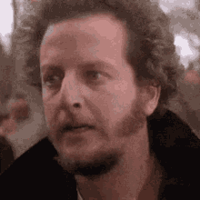

   
  <h2>Hola 👋</h2>

## 🌍 About Me

Hey there! I'm Rokas, a **data science enthusiast** with a strong foundation in **computer science**. I enjoy diving into data to uncover patterns and building machine learning models that deliver clear, actionable insights.

During my **Bachelor’s in Computer Science**, I delved into languages like Java, C#, SQL, C++, and Python, even creating a video game from scratch using Unity. While that experience was rewarding, I eventually found my passion in **data science and machine learning**, where I felt I could make a deeper impact by solving real-world challenges.

Since making that transition, I’ve worked on a variety of projects, from predictive modeling to risk analysis, focusing on **real-world applications** that drive both personal and professional growth. I enjoy working on projects involving **healthcare, sustainability, sports analytics**, and scenarios that push the boundaries of problem-solving. My goal is to create solutions that not only simplify complex data but also contribute to positive change in the world.

## 🛠️ Technologies and Tools I use:

  
  
  
  
  
  
  
  

## Let’s Connect!

- [LinkedIn](https://www.linkedin.com/in/rokas-sertvytis/)

<!--
**SertvytisRokas/SertvytisRokas** is a ✨ _special_ ✨ repository because its `README.md` (this file) appears on your GitHub profile.

Here are some ideas to get you started:

- 🔭 I’m currently working on ...
- 🌱 I’m currently learning ...
- 👯 I’m looking to collaborate on ...
- 🤔 I’m looking for help with ...
- 💬 Ask me about ...
- 📫 How to reach me: ...
- 😄 Pronouns: ...
- ⚡ Fun fact: ...
-->
